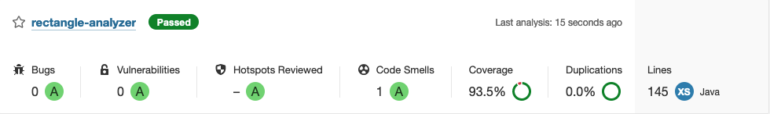

# Rectangle Analyzer

Rectangle Analyzer is a Java application that does the following: 
1) Parses input into a set of two rectangles
2) Validates those rectangles
3) Analyzes the relationship between them

## Build and test with Gradle
```bash
./gradlew build
```

## Run with Gradle
```bash
./gradlew run --args="1,2;3,4 5,6;7,8"
```

## Run as a JAR

```bash
java -jar build/libs/rectangle-analyzer.jar
```

## Build, test and run with Docker
```bash
docker build . -t rectangle-analyzer
docker run rectangle-analyzer "1,2;3,4" "5,6;7,8"
```

## Example cases


## Features

- Logging with Log4j2
- Junit5 unit and integration tests
- Gradle build scans
- Sonarqube static code analysis

- Jacoco test coverage report
- Javadocs
- Checkstyle
- Docker
